# 🛡️ OptiShield: Autonomous Parametric Insurance & Multi-Source Event Adjudication Protocol

[](https://opensource.org/licenses/MIT)
[](https://docs.genlayer.com)
[](https://github.com/genlayerlabs)
[](#-test-suite--verification)

**OptiShield** is a decentralized parametric insurance and event adjudication protocol built natively on GenLayer. It eliminates traditional insurance adjusters, claims bureaucracy, and slow dispute cycles by resolving real-world disaster, flight, and cloud SLA claims via **decentralized multi-validator neural consensus grounded on live authority web data** (FAA, NOAA, FlightAware, and official cloud status feeds).

---

## 🎯 The Real-World Problem & GenLayer Value Proposition

Traditional insurance processes take 30–90 days, suffer from high administrative overhead (adjusters, audits, manual claims verification), and feature severe counterparty conflicts of interest.

While parametric smart contracts exist on EVM chains, they are strictly limited to simple scalar numbers (e.g. basic temperature) provided by centralized oracle feeds. **They cannot parse complex, multi-source unstructured real-world events** like flight cancellation notices, hurricane landfall categories, or multi-region cloud outages.

**OptiShield solves this natively on GenLayer**:
1. **Live Authority Data Grounding (`gl.nondet.web.get`)**: Validators independently retrieve real-time telemetry from authoritative web APIs (FlightAware, NOAA National Hurricane Center, FAA).
2. **Multi-Validator Neural Consensus (`gl.vm.run_nondet_unsafe`)**: Validators analyze flight disruption causes, cancellation metadata, and policy specs under the **Equivalence Principle** (strict status matching and ±6 pt confidence tolerance).
3. **Deterministic Financial Settlement (`emit_transfer`)**: Once consensus reaches `>= 85% confidence`, the contract deterministically disburses instant indemnity payouts directly from the underwriting pool to the policyholder on finality.

---

## 🏛️ System Architecture

```mermaid
sequenceDiagram
    autonumber
    actor User as 👤 Policyholder
    participant OptiShield as 🛡️ OptiShield (GenVM)
    actor LP as 🏦 Underwriting Pool
    participant Validators as ⚖️ GenLayer Validators (Optimistic Democracy)
    participant Authority as 🌐 Authority Web Data (FAA / NOAA / FlightAware)

    LP->>OptiShield: fund_underwriting_pool() + deposit GEN
    User->>OptiShield: purchase_policy(event_type, target_id, coverage) + 5% premium
    User->>OptiShield: file_and_adjudicate_claim(evidence_url, notes)

    rect rgb(15, 23, 42)
        Note over OptiShield,Validators: Non-Deterministic Multi-Validator Consensus
        Validators->>Authority: gl.nondet.web.get(authority_evidence_url)
        Validators->>Validators: gl.nondet.exec_prompt(Evaluate policy terms & event validity)
        Validators->>Validators: Equivalence Principle Check (Verdict Match & ±6 pt confidence)
    end

    alt Claim Approved (Confidence >= 85)
        OptiShield->>User: emit_transfer(coverage_payout) [INSTANT INDEMNITY]
    else Rejected / Ineligible
        OptiShield-->>User: status = REJECTED
    end
```



---

## 🔬 Multi-Validator Equivalence Principle

| Assessment Metric | Validation Requirement |
|---|---|
| **Claim Status** | Must match exact verdict (`APPROVED`, `REJECTED`) |
| **Boolean Event Validity** | Binary `is_valid` determination must agree across leader & validators |
| **Confidence Tolerance** | Numeric confidence score (0–100) must agree within **`±6 points`** |

---

## 🧪 Test Suite & Verification

```bash
pytest tests/direct/ -v
```

### Verified Test Scenarios:
1. `test_flight_cancellation_claim_and_instant_payout`:
   - Underwriting pool funded with 200 GEN.
   - Traveler purchases 40 GEN flight delay coverage paying 2 GEN premium (5%).
   - Live FlightAware data verifies UA894 blizzard cancellation.
   - Validators reach consensus on `APPROVED` (conf: 98%) and release 40 GEN payout.
2. `test_fraudulent_claim_rejection`:
   - Non-disrupted on-time flight claims are rejected without disbursing pool reserves.
3. `test_insufficient_premium_revert`:
   - Reverts policy purchases with less than the required 5% risk premium.

---

## 📄 License

MIT © [Lesnak1](https://github.com/Lesnak1) & GenLayer Community
