# 🛡️ OptiShield: Autonomous Parametric Insurance & Multi-Source Event Adjudication Protocol

[](https://opensource.org/licenses/MIT)
[](https://docs.genlayer.com)
[](https://github.com/genlayerlabs)
[](#-test-suite--verification)

**OptiShield** is a decentralized parametric insurance and event adjudication protocol built natively on GenLayer. It eliminates traditional insurance adjusters, claims bureaucracy, and slow dispute cycles by resolving real-world disaster, flight, and cloud SLA claims via **decentralized multi-validator neural consensus grounded on live authority web data** (FAA, NOAA, FlightAware, and official cloud status feeds).

---

## 🎯 The Real-World Problem & GenLayer Value Proposition

Traditional insurance processes take 30–90 days, suffer from high administrative overhead (adjusters, audits, manual claims verification), and feature severe counterparty conflicts of interest.

While parametric smart contracts exist on EVM chains, they are strictly limited to simple scalar numbers (e.g. basic temperature) provided by centralized oracle feeds. **They cannot parse complex, multi-source unstructured real-world events** like flight cancellation notices, hurricane landfall categories, or multi-region cloud outages.

**OptiShield solves this natively on GenLayer**:
1. **Live Authority Data Grounding (`gl.nondet.web.get`)**: Validators independently retrieve real-time telemetry from authoritative web APIs (FlightAware, NOAA National Hurricane Center, FAA).
2. **Multi-Validator Neural Consensus (`gl.vm.run_nondet_unsafe`)**: Validators analyze flight disruption causes, cancellation metadata, and policy specs under the **Equivalence Principle** (strict status matching and ±6 pt confidence tolerance).
3. **Deterministic Financial Settlement (`emit_transfer`)**: Once consensus reaches `>= 85% confidence`, the contract deterministically disburses instant indemnity payouts directly from the underwriting pool to the policyholder on finality.

---

## 🏛️ Solvency, Security & Protocol Guarantees

OptiShield enforces five contract-side integrity layers:

1. **🗓️ Enforceable Runtime Timing & Coverage Windows**: Policies derive start and expiration timestamps directly from enforceable GenLayer runtime block state (`_get_runtime_timestamp()`). Claims filed outside the active coverage window or with future timestamps are strictly rejected.
2. **🌐 Strict Authority Hostname Whitelist**: Evidence URLs are parsed to extract the exact hostname, strictly neutralizing spoofing, query manipulation, and prefix bypasses (e.g., `faa.gov.attacker.com` is rejected; only exact `domain` or `.domain` subdomains are permitted). Approved authorities:
   - `faa.gov` / `api.faa.gov` (Federal Aviation Administration)
   - `noaa.gov` / `weather.gov` / `nhc.noaa.gov` (National Oceanic and Atmospheric Administration)
   - `flightaware.com` / `flightradar24.com` / `aviationstack.com` (Live Flight Telemetry)
   - `status.aws.amazon.com` / `status.cloud.google.com` / `azure.status.microsoft.com` / `cloudflarestatus.com` (Cloud Infrastructure SLA)
   - `earthquake.usgs.gov` (USGS Earthquake Hazards)
3. **📡 HTTP Fetch Success Validation**: Validators strictly verify that authority endpoints return valid HTTP 200 status codes with non-empty telemetry. Failed fetches or timeouts immediately result in rejected claims with zero confidence.
4. **⏳ Restricted Expiry Release**: Reserved liabilities for expired policies can only be released by authorized parties (the protocol owner or policyholder), and strictly after the runtime timestamp has surpassed `coverage_end_timestamp`.
5. **🏦 Reserved Payout Liabilities & Claim Finality**: When a policy is underwritten, maximum indemnity exposure is reserved against the underwriting pool (`reserved_liabilities`). The contract enforces `coverage_amount <= underwriting_pool - reserved_liabilities`, preventing over-issuance and guaranteeing 100% protocol solvency. Once adjudicated, policies reach permanent finality.

---

## 🏛️ System Architecture

```mermaid
sequenceDiagram
    autonumber
    actor User as 👤 Policyholder
    participant OptiShield as 🛡️ OptiShield (GenVM)
    actor LP as 🏦 Underwriting Pool
    participant Validators as ⚖️ GenLayer Validators (Optimistic Democracy)
    participant Authority as 🌐 Authority Web Data (FAA / NOAA / FlightAware)

    LP->>OptiShield: fund_underwriting_pool() + deposit GEN
    User->>OptiShield: purchase_policy(event_type, target_id, coverage, duration) + 5% premium
    Note over OptiShield: Locks coverage liability against unreserved pool capacity
    User->>OptiShield: file_and_adjudicate_claim(evidence_url, notes, incident_ts)
    Note over OptiShield: Enforces runtime dated coverage, exact host whitelist, and claim finality

    rect rgb(15, 23, 42)
        Note over OptiShield,Validators: Non-Deterministic Multi-Validator Consensus
        Validators->>Authority: gl.nondet.web.get(authority_evidence_url)
        Note over Validators: Validates HTTP 200 success & non-empty telemetry
        Validators->>Validators: gl.nondet.exec_prompt(Evaluate policy terms & event validity)
        Validators->>Validators: Equivalence Principle Check (Verdict Match & ±6 pt confidence)
    end

    alt Claim Approved (Confidence >= 85)
        OptiShield->>User: emit_transfer(coverage_payout) [INSTANT INDEMNITY]
    else Rejected / Ineligible
        OptiShield-->>User: status = REJECTED
    end
```



---

## 📁 Repository Structure

```
optishield-insurance/
├── contracts/
│   └── optishield.py          # Core Intelligent Contract on GenVM
├── tests/
│   ├── direct/
│   │   └── test_optishield.py # In-memory direct VM test suite
│   └── integration/
│       └── test_optishield_integration.py # StudioNet / RPC deployment integration tests
├── frontend/
│   ├── index.html             # Interactive Glassmorphic DApp UI with live GenLayer client
│   └── client.ts              # TypeScript GenLayer client integration bindings
├── package.json               # genlayer-js & development dependencies
├── requirements.txt           # Python dependencies (genlayer-test, genvm-linter)
└── README.md                  # Complete architectural & technical documentation
```

---

## 💻 Frontend & GenLayer Client Integration

The included interactive DApp (`frontend/index.html`) is connected to the real **`genlayer-js`** client, enabling full on-chain lifecycle management:

1. **Wallet / Account Management**: Auto-generates testnet keypairs or imports custom private keys.
2. **Multi-Network Support**: Switch seamlessly between **GenLayer Bradbury Testnet (4221)**, **StudioNet (4222)**, and **LocalNet**.
3. **Underwriting Reserves**: View total pool balance, reserved liabilities, and available capacity, with direct liquidity funding (`fund_underwriting_pool`).
4. **Dated Policy Purchase**: Select event type, enter target identifier, and purchase coverage with automated runtime liability reservation.
5. **Authority Claim Submission**: Submit claims with whitelisted trusted authority endpoints and trigger live multi-validator neural consensus.
6. **Live Contract State Queries**: Dynamically reads `get_policy`, `get_claim`, and `get_protocol_stats` to render real consensus confidence %, status, rationale, and on-chain balances with explorer links.

### TypeScript Client Example (`frontend/client.ts`):

```typescript
import { getGenLayerClient, fundUnderwritingPool, purchasePolicy, fileAndAdjudicateClaim, getClaim } from './frontend/client';

const client = getGenLayerClient('0xYourPrivateKey...');
const contractAddress = '0xd9F9C1c91aeb2022bdBaA9b7a535b9796b8fB8F6';

// 1. Fund Underwriting Pool (100 GEN)
await fundUnderwritingPool(client, contractAddress, 100);

// 2. Purchase Dated Flight Policy (7 days, 20 GEN coverage, 1 GEN premium)
const tx1 = await purchasePolicy(client, contractAddress, 'FLIGHT_CANCELLATION', 'UA894', 20, 86400 * 7);

// 3. File Claim with Whitelisted Trusted Authority URL & Current Timestamp
const tx2 = await fileAndAdjudicateClaim(
  client, 
  contractAddress, 
  0, 
  'https://flightaware.com/api/status/UA894', 
  'Flight UA894 blizzard cancellation',
  Math.floor(Date.now() / 1000)
);

// 4. Query Actual Contract State
const claim = await getClaim(client, contractAddress, 0);
console.log(`Status: ${claim.status}, Confidence: ${claim.consensus_confidence}%, Payout: ${claim.settled_payout}`);
```

---

## 🧪 Test Suite & Verification

```bash
pytest tests/direct/ -v
```

### Verified Test Scenarios:
1. `test_flight_cancellation_claim_and_instant_payout`:
   - Underwriting pool funded with 200 GEN.
   - Traveler purchases 40 GEN flight delay coverage for 7 days paying 2 GEN premium (5%).
   - Live FlightAware data verifies UA894 blizzard cancellation.
   - Validators reach consensus on `APPROVED` (conf: 98%) and release 40 GEN payout.
2. `test_fraudulent_claim_rejection`:
   - Non-disrupted on-time flight claims are rejected without disbursing pool reserves.
3. `test_insufficient_premium_revert`:
   - Reverts policy purchases with less than the required 5% risk premium.
4. `test_untrusted_authority_domain_bypass_reverts`:
   - Tests and rejects substring, prefix, path, and query spoofing attempts (e.g. `faa.gov.attacker.com`).
5. `test_incident_outside_coverage_window_reverts`:
   - Enforces dated coverage window bounds against incident timestamps.
6. `test_unauthorized_expiry_release_reverts`:
   - Enforces access control and expiry checks on policy liability release.

---

## 📄 License

MIT © [Lesnak1](https://github.com/Lesnak1) & GenLayer Community
